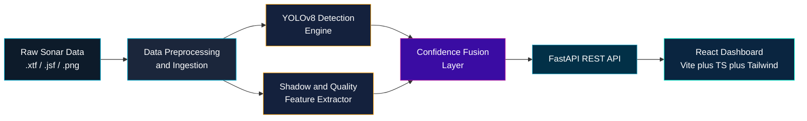
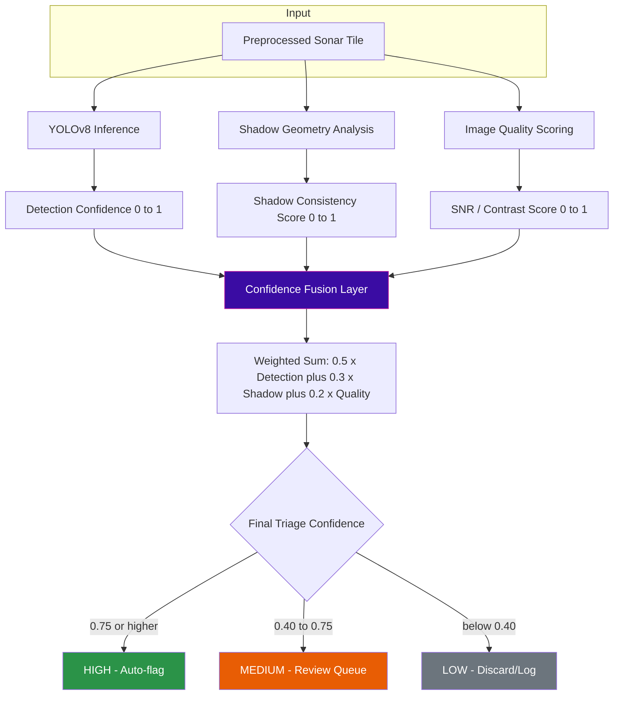

# 🌊 A B Y S S

### AI-Powered Automated Underwater Marine Debris & Anomaly Detection

**Side-Scan Sonar → Detection → Confidence Fusion → Real-Time Triage**

[](LICENSE)
[](https://www.python.org/)
[](https://pytorch.org/)
[](https://github.com/ultralytics/ultralytics)
[](https://fastapi.tiangolo.com/)
[](https://react.dev/)
[](https://vitejs.dev/)
[](#)

ABYSS ingests raw side-scan sonar imagery and outputs triaged, confidence-scored marine debris/anomaly detections through a FastAPI service and a React dashboard.

---

## 📡 System Architecture



| Stage | Responsibility | Output |
|---|---|---|
| **Preprocessing & Ingestion** | Denoise, normalize, tile sonar frames | Clean image tensors |
| **YOLOv8 Detection Engine** | Bounding-box object detection | Class, bbox, raw confidence |
| **Shadow & Quality Extractor** | Acoustic shadow geometry, SNR, texture metrics | Shadow score, quality score |
| **Confidence Fusion Layer** | Weighted fusion of detection + shadow + quality | Final triage confidence |
| **FastAPI REST API** | Serve inference & metadata | JSON payload |
| **React Dashboard** | Visualize triage queue | Operator UI |

---

## 🗺️ Phased Development Roadmap

| Phase | Module | Key Deliverable | Status |
|:---:|---|---|:---:|
| **0** | Project Scaffolding | Repo structure, env configs, CI skeleton | `[DONE]` |
| **1** | Data Pipeline | Sonar ingestion + preprocessing scripts | `[DONE]` |
| **2** | Detection Engine | YOLOv8 training + inference wrapper | `[IN PROGRESS]` |
| **3** | Shadow & Quality Extraction | OpenCV/SciPy shadow geometry + quality scoring | `[IN PROGRESS]` |
| **4** | Confidence Fusion | Fusion scoring layer + calibration | `[READY]` |
| **5** | API & Dashboard | FastAPI service + React triage UI | `[READY]` |

---

## 📂 Directory Structure

```text
abyss/
├── abyss/                          # Core ML & Backend
│   ├── ingestion/
│   │   ├── loader.py               # Raw sonar file readers (.xtf/.jsf)
│   │   └── preprocess.py           # Denoise, normalize, tile
│   ├── detection/
│   │   ├── yolo_engine.py          # YOLOv8 model wrapper (train/infer)
│   │   └── weights/                # Trained .pt checkpoints
│   ├── features/
│   │   ├── shadow_extractor.py     # Acoustic shadow geometry
│   │   └── quality_metrics.py      # SNR, contrast, texture scoring
│   ├── fusion/
│   │   └── confidence_fusion.py    # Weighted score fusion logic
│   ├── api/
│   │   ├── main.py                 # FastAPI app entrypoint
│   │   ├── routes/
│   │   │   ├── detect.py
│   │   │   └── health.py
│   │   └── schemas.py              # Pydantic request/response models
│   └── tests/                      # Pytest suite
│
├── frontend/                       # React Dashboard
│   ├── src/
│   │   ├── components/             # Triage cards, sonar viewer, charts
│   │   ├── pages/                  # Dashboard, detail views
│   │   ├── hooks/                  # API polling, state hooks
│   │   └── App.tsx
│   ├── index.html
│   ├── vite.config.ts
│   └── tailwind.config.js
│
├── data/                           # Local sonar datasets (gitignored)
├── requirements.txt
└── README.md
```

---

## ⚡ Quickstart

### 1 · Clone & Environment Setup

```bash
git clone https://github.com/<your-org>/abyss.git
cd abyss

python -m venv .venv
source .venv/bin/activate          # Windows: .venv\Scripts\activate

pip install -r requirements.txt
```

> [!NOTE]
> Place raw sonar files under `data/raw/` before running ingestion. Expected formats: `.xtf`, `.jsf`, or pre-extracted `.png` tiles.

### 2 · Run Data Ingestion

```bash
python -m abyss.ingestion.loader --input data/raw/ --output data/processed/
```

### 3 · Start Backend (FastAPI)

```bash
uvicorn abyss.api.main:app --reload --port 8000
```

> [!NOTE]
> Backend runs on **`http://localhost:8000`**. Interactive API docs available at `/docs`.

### 4 · Start Frontend (React + Vite)

```bash
cd frontend
npm install
npm run dev
```

> [!NOTE]
> Frontend dev server runs on **`http://localhost:5173`** and expects the backend at port `8000`. Update `VITE_API_BASE_URL` in `frontend/.env` if changed.

### 5 · Run Tests

```bash
pytest abyss/tests/ -v
```

---

## 🔬 Detection & Confidence Fusion Pipeline



| Fusion Input | Weight | Description |
|---|:---:|---|
| Detection Confidence (YOLOv8) | `0.5` | Raw model confidence for detected class |
| Shadow Consistency Score | `0.3` | Geometric match between object and expected acoustic shadow |
| Image Quality Score | `0.2` | Local SNR, contrast, and texture reliability of the tile |

| Triage Confidence | Band | Action |
|:---:|---|---|
| `≥ 0.75` | 🟢 HIGH | Auto-flagged for operator review |
| `0.40 – 0.75` | 🟠 MEDIUM | Queued for manual verification |
| `< 0.40` | ⚪ LOW | Logged, excluded from primary queue |

---

## 🔌 API Reference

| Endpoint | Method | Request Payload | Response Schema |
|---|:---:|---|---|
| `/health` | `GET` | — | `{ "status": "ok", "uptime": float }` |
| `/detect` | `POST` | `multipart/form-data`: `file` (sonar image) | See below |
| `/docs` | `GET` | — | Interactive Swagger UI |

**`POST /detect` — Response Schema**

```json
{
  "image_id": "string",
  "detections": [
    {
      "bbox": [0, 0, 0, 0],
      "class": "string",
      "detection_confidence": 0.0,
      "shadow_score": 0.0,
      "quality_score": 0.0,
      "fused_confidence": 0.0,
      "triage_band": "HIGH | MEDIUM | LOW"
    }
  ],
  "processing_time_ms": 0
}
```

---

## 🧪 Research Paper Scope

ABYSS is not a black-box wrapper around a pretrained model. Each pipeline stage maps to an active research area, and design decisions in this repo are grounded in the literature below rather than arbitrary defaults.

| Pipeline Stage | Research Question Being Addressed |
|---|---|
| **Preprocessing & Ingestion** | How do you correct radiometric distortion, stripe noise, and roll-induced artifacts in raw SSS returns before feeding a detector? |
| **YOLOv8 Detection Engine** | How do single-stage detectors trained on optical imagery generalize (or fail to) on low-texture, low-SNR sonar imagery, and what backbone/neck modifications recover accuracy? |
| **Shadow & Quality Extractor** | Can acoustic shadow geometry — independent of the highlight region — be used as a classification cue the way it has been in classical CAD/CAC mine-hunting systems? |
| **Confidence Fusion Layer** | Does decision-level fusion of detector confidence with shadow/quality features outperform detector confidence alone, and at what weighting? |
| **Triage Output** | What confidence thresholds are defensible for auto-flag vs. human-review bands in an operational MCM/debris-survey context? |

This scope intentionally sits between classical sonar ATR (automatic target recognition) research from the mine-countermeasures domain and modern CNN-based detection research — the fusion layer is the bridge between the two.

## 📚 Reference Papers & Resources

Curated for review and further study. Grouped by the pipeline stage each paper informs.

### Side-Scan Sonar Detection — Deep Learning Surveys

| Paper | Venue | Relevance |
|---|---|---|
| [Computer Vision Methods for Side-Scan Sonar Imagery](https://iopscience.iop.org/article/10.1088/1361-6501/ad99f1) | Measurement Science and Technology, 2024 | Survey of classification, detection, and segmentation methods on SSS; good starting map of the field |
| [A Review: Object Detection and Classification Using Side-Scan Sonar Images via Deep Learning](https://www.researchgate.net/publication/377391938_A_Review_Object_Detection_and_Classification_Using_Side_Scan_Sonar_Images_via_Deep_Learning_Techniques) | ResearchGate, 2024 | Broader review covering stripe-noise correction and dataset scarcity issues relevant to ingestion |

### YOLO-Family Detectors Adapted for Sonar

| Paper | Venue | Relevance |
|---|---|---|
| [AquaYOLO: Enhancing YOLOv8 for Accurate Underwater Object Detection for Sonar Images](https://doaj.org/article/d16b2a38f5bd40e9983eead1c71c8e2e) | Journal of Marine Science and Engineering, 2025 | Direct precedent — YOLOv8 backbone/neck modifications for sonar; benchmark on UATD + Marine Debris datasets |
| [SCR-YOLOv8: An Enhanced Algorithm for Target Detection in Sonar Images](https://link.springer.com/article/10.1007/s11554-025-01637-7) | Journal of Real-Time Image Processing, 2025 | SPDConv + spatial-channel reconstruction for low-SNR sonar targets |
| [CSC-YOLO: Side-Scan Sonar Image Detection of Shipwrecks](https://www.sciencedirect.com/org/science/article/pii/S1546221825001092) | ScienceDirect, 2025 | Addresses the precision-vs-speed tradeoff directly relevant to real-time triage |
| [Physics-Informed Side-Scan Sonar Perception (WPG-DetNet)](https://pmc.ncbi.nlm.nih.gov/articles/PMC13029880/) | PMC, 2025 | Wavelet-based denoising + graph reasoning for weak targets and sparse/discontinuous debris — closest match to anomaly detection scope |

### Acoustic Shadow Analysis & Classical CAD/CAC (Shadow Extractor Design)

| Paper | Venue | Relevance |
|---|---|---|
| [Side-Scan Sonar Mine-Like Target Detection Considering Acoustic Illumination and Shadow Characteristics](https://www.sciencedirect.com/science/article/abs/pii/S0029801825014179) | Ocean Engineering, 2025 | Shadow enhancement filter integrated with detection results — direct blueprint for the shadow extractor module |
| [Mine-Like Objects Detection Using a Shadows-Highlights Geometrical Features Space](https://www.researchgate.net/publication/311754499_Mine-Like_Objects_detection_in_Side-Scan_Sonar_images_using_a_shadows-highlights_geometrical_features_space) | ResearchGate | Geometric feature space built jointly from highlight and shadow regions |
| [Automated Classification of Mine-Like Objects Using Highlight and Shadow Information](https://www.academia.edu/84918961/Automated_approach_to_classification_of_mine_like_objects_in_sidescan_sonar_using_highlight_and_shadow_information) | Academia.edu | Affine-invariant shadow descriptors for classification — reference for the shadow feature vector design |

### Decision-Level Confidence Fusion

| Paper | Venue | Relevance |
|---|---|---|
| [Classification Using Multiple Pass Fusion](https://www.ioa.org.uk/system/files/proceedings/ad_wilby_j_kent_harbaugh_classification_using_multiple_pass_fusion.pdf) | Institute of Acoustics Proceedings, 2010 | CAD/CAC architecture fusing detection confidence with a feature list per detection — near-identical structure to the ABYSS fusion layer |
| [Automated Target Classification in High-Resolution Dual-Frequency Sonar Imagery](https://spiedigitallibrary.org/conference-proceedings-of-spie/6553/65530S/Automated-target-classification-in-high-resolution-dual-frequency-sonar-imagery/10.1117/12.717739.full) | SPIE, 2007 | Summing and log-likelihood-ratio fusion rules for combining classifier confidence scores |
| [A Large Comparison of Feature-Based Approaches for Buried Target Classification (FLGPR)](https://arxiv.org/pdf/1702.03000) | arXiv | Decision-fusion methodology (treating classifier outputs as features into a second-stage classifier) applicable to the fusion layer |

### Datasets for Training / Benchmarking

| Resource | Link | Notes |
|---|---|---|
| AI4Shipwrecks — Shipwreck Segmentation Dataset & Benchmark | [arxiv.org/html/2401.14546v1](https://arxiv.org/html/2401.14546v1) | Open-source labeled SSS dataset; useful for pretraining/fine-tuning comparisons |
| The Marine Debris Dataset for Forward-Looking Sonar Semantic Segmentation | [arxiv.org/abs/2108.06800](https://arxiv.org/abs/2108.06800) | 1,868 labeled FLS images across 11 debris/distractor classes — closest public analog to the target domain |

### Frameworks & Tooling Documentation

| Resource | Link |
|---|---|
| Ultralytics YOLOv8 | [github.com/ultralytics/ultralytics](https://github.com/ultralytics/ultralytics) |
| FastAPI | [fastapi.tiangolo.com](https://fastapi.tiangolo.com/) |
| OpenCV | [docs.opencv.org](https://docs.opencv.org/) |

---

**SIH26057** · Smart India Hackathon 2026 · Marine Debris & Anomaly Detection

***Part of this README.md is AI generated***
