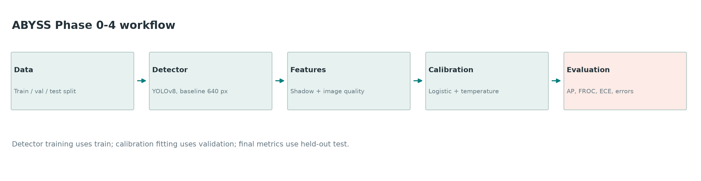
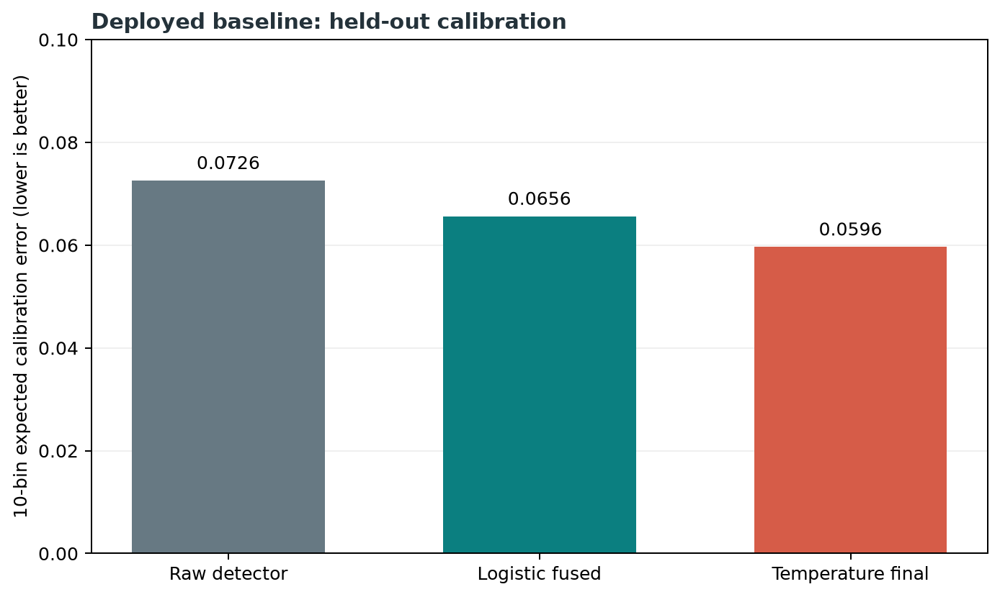
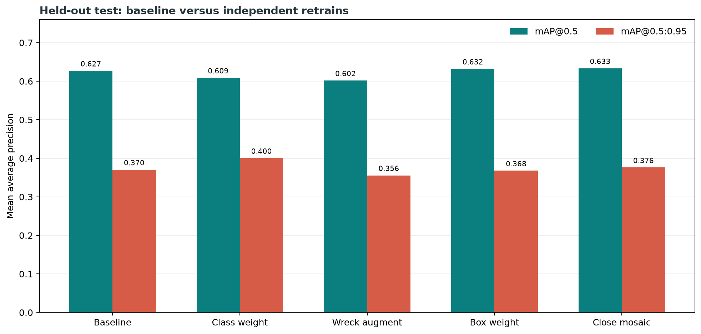
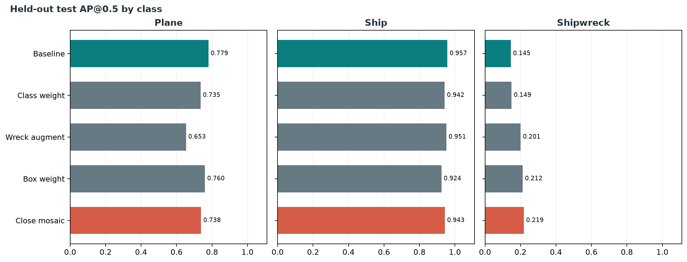
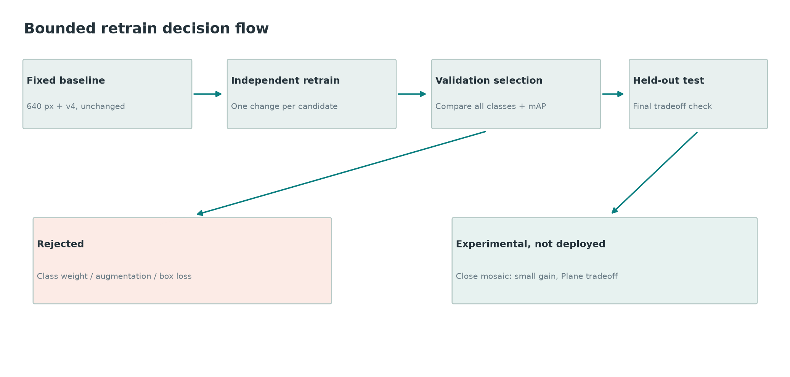

# ABYSS Project Metrics and Work Summary

**Status (2026-09-12):** Phase 0-4 audited and Phase 5 fast-mode dashboard verified; baseline-640 detector with calibration v4 remains deployed. The four later retrains are **experiments, not current performance**. [METRICS.md](METRICS.md) is the canonical detailed report for the deployed model; this file brings its results, the experiment results, and the work history together. Values below link to saved outputs from independently runnable scripts. Phase 5 does not change any model metric.

## What was built

| Phase | Work completed | Evidence / status |
| --- | --- | --- |
| 0: setup | Repository, backend, frontend prototype, run scripts, test and dependency setup. | [Implementation inventory](IMPLEMENTED_SIMULATED_FUTURE.md) |
| 1: data | Ingested sonar images, made grouped train/validation/test splits, normalized and letterboxed to 640 px, prepared YOLO labels. | [Dataset config](../abyss/data/processed/detection/data.yaml); grouping uses filename proxies, not verified survey passes. |
| 2: detection | Trained YOLOv8 and fixed baseline-640 checkpoint; added per-class held-out detection evaluation. | [Checkpoint training config](../abyss/ml/detection/runs/improved_v2_baseline_finetune_adamw/args.yaml), [mAP output](../abyss/logs/phase4_corrected_map.json). |
| 3: confidence | Kept shadow and image-quality features, fitted model-specific logistic fusion and validation-only temperature scaling; exposed raw, fused, and calibrated scores separately. | [Calibration v4](../abyss/ml/shadow_confidence/calibration_improved_v4.json), [fit summary](../abyss/logs/phase3_calibration_improved_v4/summary.json). |
| 4: evaluation | Corrected configuration mismatch; measured AP, FROC/Pd, 3-way ECE, reliability, precision/recall/F1, confusion, and missing-geolocation-data status. Removed a filename-based Plane override so native model errors are visible. | [Canonical deployed metrics](METRICS.md), [implementation status](IMPLEMENTED_SIMULATED_FUTURE.md). |
| Bounded improvement | Independently retrained class-weight, Shipwreck-augmentation, box-weight, and mosaic-schedule candidates; compared all three classes and both aggregate mAP metrics. | [Full experiment audit](../logs/bounded_experiment_report.md); no candidate deployed. |
| 5: frontend, fast mode | Replaced the prototype with live upload/detect, returned-coordinate boxes, separate raw/fused/calibrated confidence, real priority ranking, explicit coordinate-source tags, and visible backend-down errors. | [One-image and error-state verification](../logs/phase5_frontend/verification.md); Phase 6/7 not started. |

The backend returns model predictions and uses supplied navigation data for geolocation; without real navigation data it uses a simulated fallback origin. This is not a measured coordinate. Priority weights are policy choices, not learned detection confidence. The fast-mode React dashboard is functional but deliberately not a polished or broadly tested interface.

## Current deployed detector

The deployed best-checkpoint SHA-256 is `baef8d00dbd8d764e61c59bf411c95da67936834552fb80428771cf69a7d6a5d`; preprocessing and evaluation use 640 px. The held-out test split has **129 images and 111 labels**. These are standard Ultralytics AP metrics from [the test run](../abyss/logs/phase4_corrected_map.json), not threshold-specific precision/recall.

| Class | Ground truth | AP@0.5 | AP@0.5:0.95 |
| --- | ---: | ---: | ---: |
| Plane | 17 | 0.779424 | 0.378747 |
| Ship | 74 | 0.957086 | 0.674665 |
| Shipwreck | 20 | 0.144992 | 0.058058 |
| **Overall mAP** | **111** | **0.627168** | **0.370490** |

The same test run reported mean inference latency **29.829 ms/image** on the recorded host. This is a host/run observation, not a guaranteed deployment speed. [Source JSON](../abyss/logs/phase4_corrected_map.json).

### Fixed-threshold operating points

Class-aware one-to-one matching at IoU >= 0.5, thresholded on **raw detector confidence**. These are not interchangeable with threshold-integrated AP. [Raw counts and matrices](../abyss/logs/phase4_corrected_details/summary.json).

| Raw threshold | TP | FP | FN | Precision | Recall | F1 |
| ---: | ---: | ---: | ---: | ---: | ---: | ---: |
| 0.05 diagnostic | 86 | 131 | 25 | 0.396313 | 0.774775 | 0.524390 |
| 0.25 deployed | 77 | 44 | 34 | 0.636364 | 0.693694 | 0.663793 |

At 0.25, ground-truth rows and predicted columns include Background for misses/false alarms:

| Truth / prediction | Plane | Ship | Shipwreck | Background |
| --- | ---: | ---: | ---: | ---: |
| Plane | 1 | 13 | 0 | 3 |
| Ship | 0 | 71 | 0 | 3 |
| Shipwreck | 0 | 0 | 3 | 17 |
| Background | 2 | 16 | 15 | 0 |

[Confusion plot](../abyss/logs/phase4_corrected_details/confusion_raw_0.25.png) · [Precision-recall plot](../abyss/logs/phase4_corrected_details/pr_curve.png)

### Calibration and FROC

Calibration v4 was fitted on validation predictions, never on test. The split audit found zero validation/test filename or exact-content overlap. Ten-bin ECE uses class-aware IoU >= 0.5 correctness. [Validation fit](../abyss/logs/phase3_calibration_improved_v4/summary.json) · [test ECE run](../abyss/logs/phase4_corrected_reliability/summary.json).

| Split | Predictions | Correct | Incorrect | Raw ECE | Logistic-fused ECE | Temperature-final ECE |
| --- | ---: | ---: | ---: | ---: | ---: | ---: |
| Validation, in-sample | 227 | 87 | 140 | 0.083756 | 0.096462 | 0.097176 |
| Held-out test | 217 | 86 | 131 | 0.072560 | 0.065603 | 0.059635 |

[Raw reliability diagram](../abyss/logs/phase4_corrected_reliability/reliability_raw_detector.png) · [Logistic reliability diagram](../abyss/logs/phase4_corrected_reliability/reliability_logistic_fused.png) · [Temperature reliability diagram](../abyss/logs/phase4_corrected_reliability/reliability_temperature_calibrated.png)

Using final calibrated probability to rank 217 test candidates, the monotonic FROC has **Pd 0.774775 (86/111)** at the best observed point **0.821705 FP/image (106/129)** below the 1 FP/image target; final-score threshold **0.057584**. This is an observed point, not interpolation at exactly 1 FP/image. [FROC output](../abyss/logs/phase4_corrected_froc/summary.json) · [FROC curve](../abyss/logs/phase4_corrected_froc/froc.png).

## Bounded retrain comparison

Each candidate was independently trained from the same initialization with one specified change. The table is **held-out test**, and each class/overall cell is AP@0.5 / AP@0.5:0.95. Validation selection and all checkpoint hashes are in [the experiment report](../logs/bounded_experiment_report.md); the exact saved test outputs are under `abyss/logs/bounded_*_test.json`.

| Checkpoint | Plane | Ship | Shipwreck | Overall mAP | Status |
| --- | ---: | ---: | ---: | ---: | --- |
| Baseline-640/v4 | 0.779424 / 0.378747 | 0.957086 / 0.674665 | 0.144992 / 0.058058 | 0.627168 / 0.370490 | **Current** |
| Shipwreck loss weight | 0.735472 / 0.457477 | 0.941927 / 0.668797 | 0.149287 / 0.074910 | 0.608895 / 0.400395 | Discarded: validation and AP@0.5 tradeoffs |
| Shipwreck-only augmentation | 0.653440 / 0.353499 | 0.951313 / 0.627589 | 0.200944 / 0.085831 | 0.601899 / 0.355640 | Discarded: overall and Plane regression |
| Box loss 9.0 | 0.759924 / 0.389192 | 0.924013 / 0.646498 | 0.212485 / 0.067935 | 0.632141 / 0.367875 | Discarded: target mAP@0.5:0.95 regression |
| Close mosaic 15 | 0.738115 / 0.390198 | 0.943036 / 0.649396 | 0.219042 / 0.088640 | 0.633398 / 0.376078 | Experimental only: small overall gain, Plane tradeoff |

The **validation** comparison below was used for candidate selection before final test inspection; each cell again shows AP@0.5 / AP@0.5:0.95. The validation split has 136 images. [Saved baseline validation run](../abyss/logs/bounded_baseline_val.json) and [candidate validation runs](../logs/bounded_experiment_report.md).

| Checkpoint | Plane | Ship | Shipwreck | Overall mAP |
| --- | ---: | ---: | ---: | ---: |
| Baseline-640 | 0.703030 / 0.448000 | 0.899260 / 0.623524 | 0.218147 / 0.070668 | 0.606812 / 0.380731 |
| Shipwreck loss weight | 0.639907 / 0.375494 | 0.886575 / 0.617705 | 0.248880 / 0.100010 | 0.591787 / 0.364403 |
| Shipwreck-only augmentation | 0.687521 / 0.469052 | 0.886047 / 0.580937 | 0.273395 / 0.075344 | 0.615654 / 0.375111 |
| Box loss 9.0 | 0.725885 / 0.481569 | 0.904291 / 0.609236 | 0.152828 / 0.051043 | 0.594335 / 0.380616 |
| Close mosaic 15 | 0.742573 / 0.545134 | 0.908479 / 0.616135 | 0.195402 / 0.082856 | 0.615485 / 0.414709 |

**Final decision:** keep baseline-640/v4 current; no candidate adopted. Close mosaic is the only candidate with gains in both aggregate validation and test mAP, but its test mAP@0.5:0.95 gain is only **0.005588** while Plane AP@0.5 falls **0.041309** and Ship AP@0.5 falls **0.014050**. It is preserved as an experiment, not wired into inference. Optional AI4Shipwrecks and 960px retrains were not attempted.

An earlier **raw-confidence threshold sweep** chose 0.55 by validation micro-F1: validation F1 rose from **0.599222** at deployed 0.25 to **0.663636**; test F1 rose from **0.663793** to **0.726316**. However, at 0.55 the test confusion matrix has **zero Plane predictions** and 13/17 Plane labels missed entirely. The threshold was discarded; deployed raw threshold remains **0.25**. Its test comparison is exploratory because the sweep was motivated by prior inspection of the test report. [Full threshold audit](../logs/improvement_log.md).

## Limitations and superseded data

| Item | Honest status |
| --- | --- |
| Positional RMSE | Not measurable: no paired real object coordinates or navigation ground truth. |
| FP/km and FP/km²; area-based Pd | Not computable: no surveyed trackline distance or area. |
| Sensor frequency, swath width, survey speed | Not available in acquisition metadata. |
| Validation ECE | In-sample and bin-sensitive: with 5 bins raw/fused/final is 0.063979/0.044664/0.045771, while with 10 bins it is 0.083756/0.096462/0.097176. The apparent regression reverses with binning; this is not proof that calibration generalizes. [Bin audit](../abyss/logs/phase3_calibration_improved_v4/ece_bin_audit.json). |
| Native class errors | At raw threshold 0.25, 13/17 Plane labels match Ship predictions and 17/20 Shipwreck labels remain unmatched. The old filename-based Plane override was removed, not replaced. |
| Survey split independence | Filename-derived grouping is a proxy, not navigation-confirmed pass separation. |

**SUPERSEDED:** the prior 768px enhanced-preprocessing run used a mismatched configuration with the baseline-640-trained checkpoint. Its mAP@0.5 **0.431430**, mAP@0.5:0.95 **0.184853**, precision/recall **0.430340/0.353604**, FROC Pd **0.648649** at <=1 FP/image, and v3 raw/fused/final ECE **0.063784/0.061875/0.060843** remain in [METRICS.md](METRICS.md) solely for audit. They are **not** deployed-model results.

## Reproduce the visuals

From the repository root, run `.venv/bin/python abyss/ml/detection/plot_project_metrics.py`. It reads the saved baseline, candidate, and calibration JSONs; checks the fixed checkpoint and test split; and regenerates the five PNGs above in `docs/figures/`. The underlying metrics are generated by the evaluation scripts linked in [METRICS.md](METRICS.md) and [the experiment report](../logs/bounded_experiment_report.md). Charts never substitute for their numerical source outputs.
